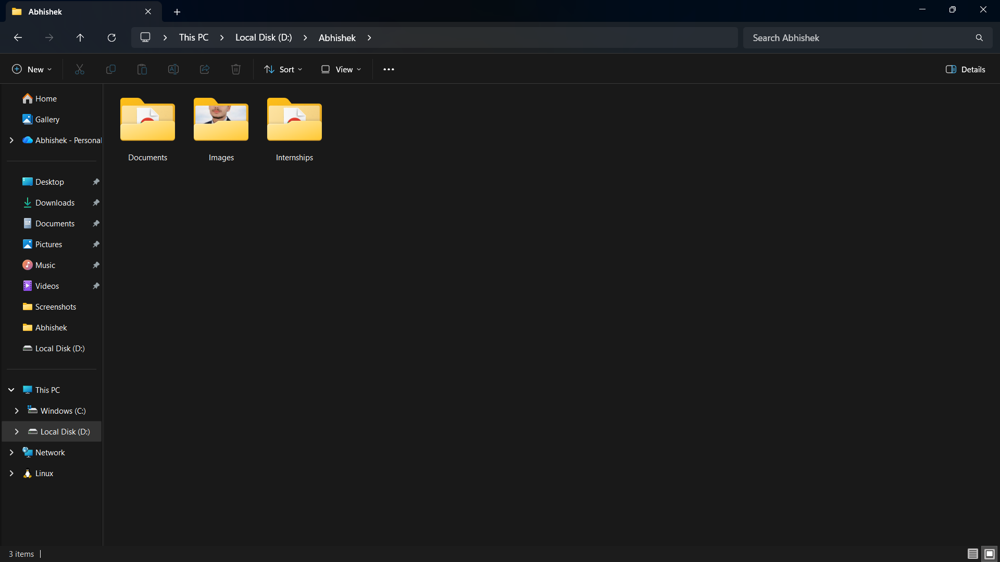

# 📂 Python CLI File Organizer

A simple yet powerful **Python Command Line File Organizer** that automatically organizes files in a folder into categorized subfolders like **Images, Documents, Videos, Audio, Archives, and Others**.

Perfect for keeping your **Downloads**, **Desktop**, or any messy folder clean ✨

---

## 🚀 Features

✅ Automatically organizes files by extension
✅ Creates folders dynamically if not present
✅ Supports multiple file types
✅ Simple CLI-based interaction
✅ Beginner-friendly Python project
✅ Cross-platform (Windows, macOS, Linux)

---

## 📁 File Categories Supported

| Category     | Extensions                                |
| ------------ | ----------------------------------------- |
| 🖼 Images    | `.jpg`, `.jpeg`, `.png`, `.gif`, `.bmp`   |
| 📄 Documents | `.pdf`, `.docx`, `.txt`, `.pptx`, `.xlsx` |
| 🎬 Videos    | `.mp4`, `.mkv`, `.avi`                    |
| 🎵 Audio     | `.mp3`, `.wav`                            |
| 🗜 Archives  | `.zip`, `.rar`, `.7z`                     |
| 📦 Others    | Any unsupported file types                |

---

## 🛠 How It Works

1️⃣ User provides a folder path
2️⃣ Script scans all files in the folder
3️⃣ Files are moved into categorized subfolders
4️⃣ Unknown files go into **Others** folder

---

## ▶️ How to Run

```bash
python file_organizer.py
```

Then enter the folder path when prompted:

```text
Enter folder path to organize: C:\Users\Abhishek\Downloads
```

---

## 🧠 Example Output

```text
✅ Moved resume.pdf -> Documents
✅ Moved song.mp3 -> Audio
✅ Moved photo.png -> Images
📁 Moved unknown.xyz -> Others
```

---

## 🖼 Project Screenshots (Optional)

You can add screenshots like:




---

## 🎥 Video Demo (Optional)

📺 **Watch the full demo here:**
👉 [https://youtu.be/your-demo-video-link]

*(Replace with your actual video link)*

---

## 🧩 Folder Structure After Organization

```text
📂 Target Folder
 ├── Images
 ├── Documents
 ├── Videos
 ├── Audio
 ├── Archives
 └── Others
```

---

## 🔧 Technologies Used

* 🐍 Python 3
* 📁 pathlib
* 📦 shutil
* 🖥 CLI (Command Line Interface)

---

## 🌟 Future Enhancements

✨ Add recursive folder support
✨ Add GUI using Tkinter
✨ Custom category support via config file
✨ Logging support
✨ Dry-run mode

---

## 🤝 Contribution

Pull requests are welcome!
Feel free to **fork**, improve, and submit a PR 🚀

---

## 📜 License

This project is licensed under the **MIT License** 📄

---

## ❤️ Author

**Abhishek Yadav**
💻 Python Developer | 🚀 Learning by Building

---

If you want, I can also:

* 📌 Optimize this README for **GitHub stars**
* 🎯 Make it **resume-ready**
* 🧠 Convert it into a **portfolio project description**
* 🎥 Write a **YouTube video script** for this project

Just tell me 😄
